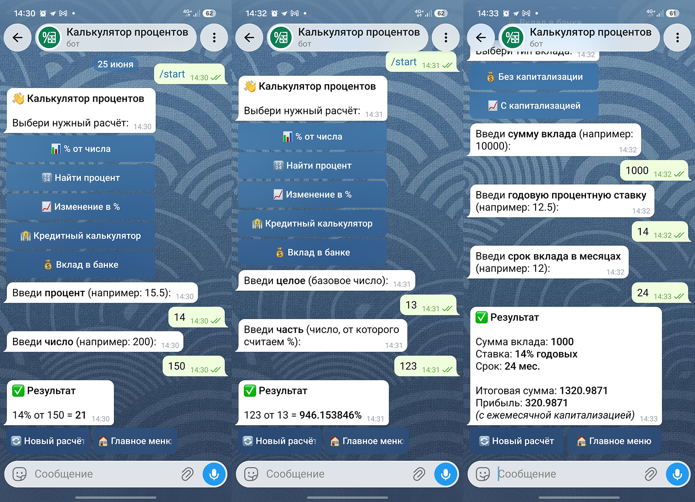

# 📊 Percentage Calculator Telegram Bot

A Telegram bot for quick percentage calculations. Clean interface, instant results.

## Screenshots



## Features

**📊 % of a number**
> 12% of 2000 = 240

**🔢 Find percentage**
> 100 out of 2000 = 5%

**📈 Percentage change**
> 20 → 100 = +400%

**🏦 Loan calculator**
> Amount, rate, term → monthly payment + overpayment

**💰 Bank deposit**
> Simple interest and compound interest

## Tech Stack

- Python 3.12
- aiogram 3.x
- FSM (Finite State Machine)
- pydantic-settings
- Logging
- Type Hints
- Modular Architecture
- Deployed on Railway

## Project Structure

```
percent_bot/
├── bot.py              # entry point
├── config.py           # settings from .env
├── requirements.txt
├── .env.example
│
├── handlers/           # message and callback handlers
├── keyboards/          # inline keyboards
├── services/           # pure math functions
├── states/             # FSM state groups
├── texts/              # all UI strings
├── utils/              # formatting and validation
└── logs/
```

## Local Setup

```bash
# 1. Clone the repo
git clone https://github.com/paultarasenko/percent-bot.git
cd percent-bot

# 2. Create virtual environment
python -m venv venv

# Windows (PowerShell):
venv\Scripts\Activate.ps1

# Windows (Git Bash):
source venv/Scripts/activate

# macOS / Linux:
source venv/bin/activate

# 3. Install dependencies
pip install -r requirements.txt

# 4. Create .env
cp .env.example .env
# Add your bot token: BOT_TOKEN=...

# 5. Run
python bot.py
```

## Deploy on Railway

1. Push project to GitHub
2. In Railway: **New Project → Deploy from GitHub repo**
3. Add environment variable: `BOT_TOKEN=your_token`
4. Railway will start the bot automatically

## Environment Variables

| Variable | Description | Default |
|---|---|---|
| `BOT_TOKEN` | Token from @BotFather | required |
| `LOG_LEVEL` | Logging level | `INFO` |
| `USE_WEBHOOK` | Use webhook instead of polling | `false` |
| `WEBHOOK_HOST` | Webhook URL | — |
| `WEBHOOK_PATH` | Webhook path | `/webhook` |
| `WEBHOOK_PORT` | Webhook port | `8080` |

## License

MIT License

## Author

[@paultarasenko](https://github.com/paultarasenko)
